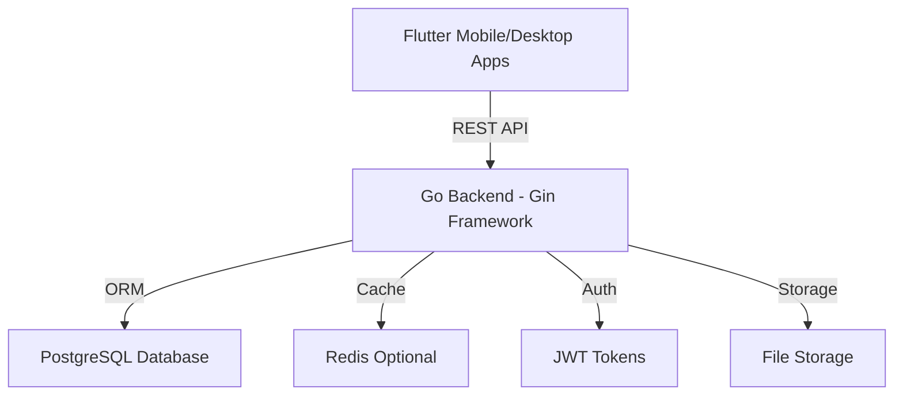

<div align="center">

# 🧭 MERIDIEN

### Multi-tenant Enterprise Retail & Inventory Digital Intelligence Engine

*Navigate Your Business to Success*

A comprehensive enterprise-grade platform for managing retail operations, inventory, and multi-tenant business intelligence. Built with Go and Flutter for maximum performance and cross-platform compatibility.

[](#)
[](https://golang.org/)
[](https://flutter.dev/)
[](https://www.postgresql.org/)

[Documentation](./docs/) · [Report Bug](https://github.com/mu7ammad-3li/MERIDIEN/issues) · [Request Feature](https://github.com/mu7ammad-3li/MERIDIEN/issues)

</div>

---

## 📑 Table of Contents

- [Overview](#-overview)
- [Features](#-features)
- [Architecture](#-architecture)
- [Tech Stack](#-tech-stack)
- [Getting Started](#-getting-started)
  - [Prerequisites](#prerequisites)
  - [Quick Start](#quick-start)
  - [Manual Setup](#manual-setup)
- [Project Structure](#-project-structure)
- [Documentation](#-documentation)
- [Development](#-development)
- [License](#-license)
- [Contact](#-contact)

---

## 🌟 Overview

**MERIDIEN** (Multi-tenant Enterprise Retail & Inventory Digital Intelligence Engine) is a sophisticated business management platform designed for modern retail enterprises. It provides comprehensive tools for inventory management, customer relationship management, sales tracking, and business analytics—all in a multi-tenant architecture.

The name "MERIDIEN" evokes navigation and direction, symbolizing how the platform guides businesses toward success through data-driven insights and intelligent automation.

---

## ✨ Features

<table>
<tr>
<td width="50%">

### 🎯 Core Business Features
- **Multi-Tenant Architecture**: Isolated data and customization per business
- **Inventory Management**: Real-time stock tracking and alerts
- **Customer Management**: Complete CRM with purchase history
- **Order Processing**: End-to-end order management
- **Sales Analytics**: Revenue insights and performance metrics
- **User Authentication**: Secure JWT-based authentication

</td>
<td width="50%">

### 🔒 Enterprise Features
- **Role-Based Access Control**: Granular permissions system
- **API-First Design**: RESTful APIs for all operations
- **Real-time Updates**: Live data synchronization
- **Audit Logging**: Complete activity tracking
- **Data Export**: CSV/PDF report generation
- **Mobile & Desktop**: Flutter apps for all platforms

</td>
</tr>
</table>

---

## 🏗️ Architecture

MERIDIEN follows a clean architecture pattern with clear separation of concerns:



### Key Architectural Principles

- **API-First**: All functionality exposed through RESTful APIs
- **Multi-Tenancy**: Tenant isolation at database and application level
- **Scalability**: Designed for horizontal scaling
- **Security**: JWT authentication, RBAC, and data encryption
- **Maintainability**: Clean code, comprehensive testing, and documentation

---

## 🛠 Tech Stack

<div align="center">

### Backend


### Frontend


### DevOps


</div>

---

## 🚀 Getting Started

### Prerequisites

- **Go 1.21+** ([Download](https://golang.org/dl/))
- **Flutter 3.24+** ([Download](https://flutter.dev/docs/get-started/install))
- **PostgreSQL 16+** ([Download](https://www.postgresql.org/download/))
- **Git** ([Download](https://git-scm.com/downloads))

### Quick Start

Use the automated setup scripts for fastest deployment:

```bash
# Clone the repository
git clone https://github.com/mu7ammad-3li/MERIDIEN.git
cd MERIDIEN

# Setup entire project (backend + frontend + database)
./scripts/setup.sh

# Run in development mode
./scripts/dev.sh

# Run tests
./scripts/test.sh
```

### Manual Setup

#### Backend Setup

1. **Navigate to backend directory**
```bash
cd backend
```

2. **Install Go dependencies**
```bash
go mod download
```

3. **Configure environment**

Create `.env` file in `backend/` directory:

```env
# Database
DB_HOST=localhost
DB_PORT=5432
DB_USER=meridien
DB_PASSWORD=your_secure_password
DB_NAME=meridien_db
DB_SSLMODE=disable

# JWT
JWT_SECRET=your_jwt_secret_key_here
JWT_EXPIRY=24h

# Server
PORT=8080
GIN_MODE=debug

# CORS
ALLOWED_ORIGINS=http://localhost:*,http://127.0.0.1:*
```

4. **Setup database**
```bash
# Create database
createdb meridien_db

# Run migrations
go run main.go migrate
```

5. **Run backend server**
```bash
go run main.go
```

Backend API will be running at: **http://localhost:8080**

#### Frontend Setup

1. **Navigate to frontend directory**
```bash
cd frontend
```

2. **Install Flutter dependencies**
```bash
flutter pub get
```

3. **Configure API endpoint**

Edit `lib/config/api_config.dart`:

```dart
class ApiConfig {
  static const String baseUrl = 'http://localhost:8080';
  static const String apiVersion = 'v1';
}
```

4. **Run Flutter app**

```bash
# For mobile (requires emulator/device)
flutter run

# For web
flutter run -d chrome

# For desktop (macOS)
flutter run -d macos

# For desktop (Windows)
flutter run -d windows

# For desktop (Linux)
flutter run -d linux
```

---

## 📁 Project Structure

```
MERIDIEN/
├── 📂 backend/                      # Go Backend
│   ├── 📂 cmd/                     # Application entry points
│   │   └── main.go
│   ├── 📂 internal/                # Internal packages
│   │   ├── 📂 api/                # API handlers
│   │   │   ├── 📂 middleware/     # HTTP middleware
│   │   │   ├── 📂 routes/         # Route definitions
│   │   │   └── 📂 handlers/       # Request handlers
│   │   ├── 📂 domain/             # Business logic
│   │   │   ├── 📂 models/         # Data models
│   │   │   ├── 📂 services/       # Business services
│   │   │   └── 📂 repositories/   # Data access
│   │   ├── 📂 config/             # Configuration
│   │   └── 📂 utils/              # Utilities
│   ├── 📂 migrations/              # Database migrations
│   ├── 📂 tests/                   # Backend tests
│   ├── go.mod                      # Go dependencies
│   ├── go.sum                      # Dependency checksums
│   └── .env                        # Environment config
├── 📂 frontend/                     # Flutter Frontend
│   ├── 📂 lib/                     # Dart source code
│   │   ├── 📂 config/             # App configuration
│   │   ├── 📂 models/             # Data models
│   │   ├── 📂 services/           # API services
│   │   ├── 📂 providers/          # State management
│   │   ├── 📂 screens/            # UI screens
│   │   │   ├── 📂 auth/          # Authentication screens
│   │   │   ├── 📂 dashboard/     # Dashboard screens
│   │   │   ├── 📂 inventory/     # Inventory screens
│   │   │   └── 📂 customers/     # Customer screens
│   │   ├── 📂 widgets/            # Reusable widgets
│   │   ├── 📂 utils/              # Utilities
│   │   └── main.dart              # App entry point
│   ├── 📂 test/                    # Flutter tests
│   ├── pubspec.yaml                # Flutter dependencies
│   └── analysis_options.yaml       # Dart analyzer config
├── 📂 docs/                        # Documentation
│   ├── MERIDIEN-BRAND.md           # Brand guidelines
│   ├── plan-three.md               # Technical architecture
│   ├── mvp-analysis.md             # MVP analysis
│   ├── DEVELOPMENT-RULES.md        # Development guidelines
│   └── 📂 guides/                 # Setup guides
│       ├── BACKEND-SETUP.md
│       └── FRONTEND-SETUP.md
├── 📂 scripts/                     # Automation scripts
│   ├── setup.sh                    # Complete setup
│   ├── dev.sh                      # Development mode
│   └── test.sh                     # Run tests
├── .gitignore                      # Git ignore rules
├── LICENSE                         # License file
└── README.md                       # This file
```

---

## 📚 Documentation

Comprehensive documentation is available in the `docs/` directory:

- **[Brand Guidelines](docs/MERIDIEN-BRAND.md)** - Visual identity and branding
- **[Technical Architecture](docs/plan-three.md)** - System design and architecture
- **[MVP Analysis](docs/mvp-analysis.md)** - Minimum viable product scope
- **[Development Rules](docs/DEVELOPMENT-RULES.md)** - Coding standards and practices
- **[Backend Setup Guide](docs/guides/BACKEND-SETUP.md)** - Detailed backend setup
- **[Frontend Setup Guide](docs/guides/FRONTEND-SETUP.md)** - Detailed frontend setup

---

## 💻 Development

### Available Scripts

```bash
# Complete project setup
./scripts/setup.sh

# Run in development mode (backend + frontend)
./scripts/dev.sh

# Run all tests
./scripts/test.sh

# Backend only
cd backend
go run main.go

# Frontend only
cd frontend
flutter run
```

### API Endpoints

Key API endpoints (see full API docs at `/api/docs` when running):

```
# Authentication
POST   /api/v1/auth/register
POST   /api/v1/auth/login
POST   /api/v1/auth/refresh

# Customers
GET    /api/v1/customers
POST   /api/v1/customers
GET    /api/v1/customers/:id
PUT    /api/v1/customers/:id
DELETE /api/v1/customers/:id

# Inventory
GET    /api/v1/inventory
POST   /api/v1/inventory
GET    /api/v1/inventory/:id
PUT    /api/v1/inventory/:id
DELETE /api/v1/inventory/:id

# Orders
GET    /api/v1/orders
POST   /api/v1/orders
GET    /api/v1/orders/:id
PUT    /api/v1/orders/:id
```

### Running Tests

```bash
# Backend tests
cd backend
go test ./...

# Frontend tests
cd frontend
flutter test
```

---

## 📝 License

Copyright © 2024 MERIDIEN. All rights reserved.

This project is proprietary software. Unauthorized copying, modification, or distribution is strictly prohibited.

---

## 📧 Contact

**Muhammad Ali**

- GitHub: [@mu7ammad-3li](https://github.com/mu7ammad-3li/)
- Email: muhammad.3lii2@gmail.com
- LinkedIn: [linkedin.com/in/muhammad-3lii](https://linkedin.com/in/muhammad-3lii)

**Project Link**: [https://github.com/mu7ammad-3li/MERIDIEN](https://github.com/mu7ammad-3li/MERIDIEN)

---

## 🙏 Acknowledgments

- [Go](https://golang.org/) - High-performance backend language
- [Gin](https://gin-gonic.com/) - Fast HTTP web framework
- [Flutter](https://flutter.dev/) - Beautiful native applications
- [PostgreSQL](https://www.postgresql.org/) - Powerful relational database
- [GORM](https://gorm.io/) - Go ORM library

---

<div align="center">

**Built with ❤️ by [Muhammad Ali](https://github.com/mu7ammad-3li/)**

*Navigate Your Business to Success*

[⬆ Back to Top](#-meridien)

</div>
